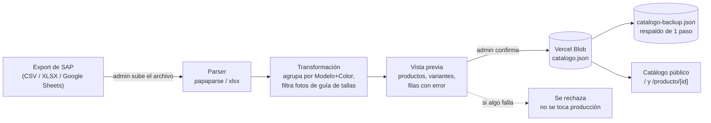
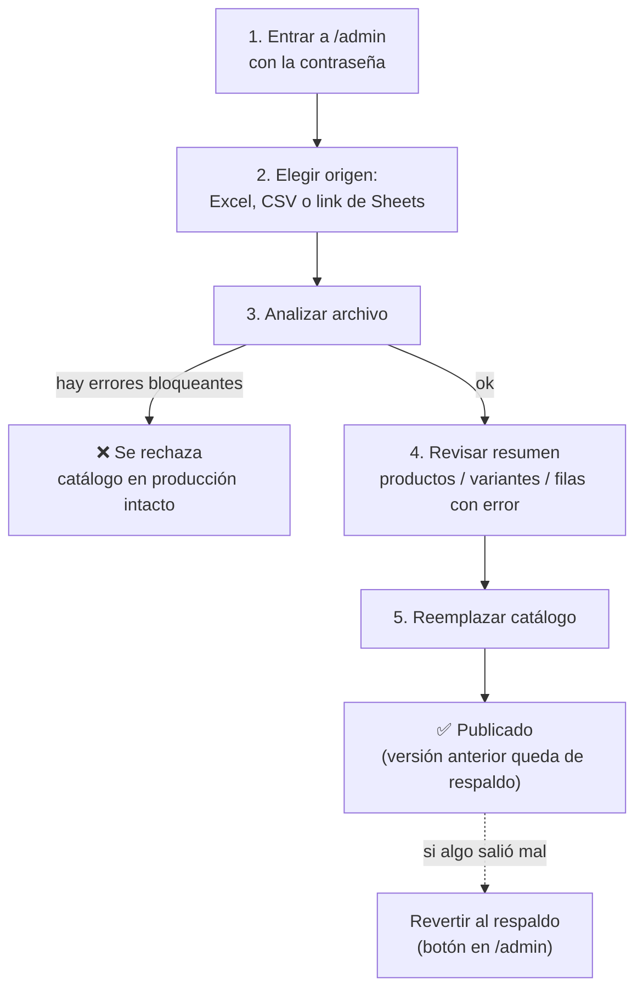

<div align="center">

# 👟 Catálogo Mayorista — Calzados Mesvol

**Catálogo digital de solo lectura para venta al mayor**, con carga de datos manual desde el export de SAP y cero base de datos.


</div>

---

## ¿Qué es esto?

El dueño del negocio comparte un **link público** con sus clientes mayoristas
para que naveguen el catálogo de calzado desde el celular (pensado para
compartirse por WhatsApp). No hay carrito ni checkout — es solo vista.

Un único administrador carga los datos entrando a `/admin` con una
contraseña, subiendo el archivo que exporta directamente desde SAP (o
pegando un link de Google Sheets). No hace falta tocar código para publicar
un catálogo nuevo.

| | |
|---|---|
| 🛍️ **Catálogo público** | `/` — grid con filtros, buscador, detalle de producto con carrusel de fotos y selector de talla |
| 🔐 **Panel admin** | `/admin` — un solo usuario, contraseña por variable de entorno, protegido con cookie firmada |
| 📦 **Almacenamiento** | Vercel Blob — un archivo JSON, sin PostgreSQL/Supabase/MySQL ni nada por el estilo |
| 📥 **Fuente de datos** | CSV, Excel (XLSX), o un Google Sheets publicado como CSV — export directo de SAP |

## Funcionalidades

- **Catálogo público:** grid responsive (2 columnas en celular, 3–4 en desktop), filtros por marca / género / color / rango de precio, buscador por modelo, estados vacíos y skeletons cuidados, imágenes con lazy loading y fallback si una foto rompe.
- **Detalle de producto:** carrusel de fotos, selector de talla (las agotadas se ven tachadas, no solo deshabilitadas), cantidad mínima por bulto, link aparte a la guía de tallas.
- **Panel de administración:** sube CSV/XLSX/link de Sheets → el sistema valida y muestra un **resumen previo** (productos detectados, variantes, filas con error) → el admin confirma explícitamente → recién ahí se reemplaza el catálogo en producción.
- **Respaldo de un paso:** antes de reemplazar, la versión anterior se guarda aparte. Si algo salió mal, un botón en `/admin` revierte al respaldo.
- **Validación estricta:** si faltan columnas obligatorias o el archivo no tiene ninguna fila válida, se rechaza el reemplazo completo — el catálogo en producción nunca queda a medio actualizar.

## Cómo funciona (arquitectura)



No hay base de datos relacional: `catalogo.json` **es** el catálogo. Cada
carga nueva lo reemplaza por completo (con respaldo automático de la versión
anterior).

## Stack técnico

| Pieza | Elección | Por qué |
|---|---|---|
| Framework | [Next.js 16](https://nextjs.org) (App Router) | SSR simple, rutas de API integradas, deploy nativo en Vercel |
| Lenguaje | TypeScript | tipado en la transformación de datos, donde más se necesita |
| Estilos | Tailwind CSS v4 | sistema de diseño consistente sin escribir CSS a mano |
| Parsing CSV | [papaparse](https://www.papaparse.com/) | estándar de facto, tolerante a archivos reales |
| Parsing Excel | [xlsx (SheetJS)](https://sheetjs.com/) | lee `.xlsx` sin depender de Excel/Google |
| Almacenamiento | [Vercel Blob](https://vercel.com/docs/storage/vercel-blob) | un JSON versionado a mano, cero mantenimiento de base de datos |

## Columnas del archivo de origen (SAP)

El export trae **una fila por variante talla+color** (no una fila por
producto) — el sistema las agrupa. Columnas que sí se usan:

| Columna en el SAP | Para qué se usa |
|---|---|
| `Nombre modelo` | agrupador de producto (obligatoria) |
| `Color` | agrupador de producto (obligatoria) |
| `Talla` | variante dentro del producto (obligatoria) |
| `Price` | precio en USD (obligatoria) |
| `BcdCode` | identificador de la variante (obligatoria) |
| `Marca`, `U_PX_Genero` | metadata de producto |
| `Disponible` | stock de esa talla — si es 0, se muestra "Agotada" |
| `Todas las fotos y guia de tallas` | URLs separadas por coma; las que contienen `guiaTallasMesvol` se separan como guía de tallas, el resto son fotos reales |
| `Materiales del exterior/interior/de la suela`, `Tipo de calzado` | ficha técnica opcional |

Las columnas en negrita arriba ("obligatoria") son las que el sistema exige
para aceptar el archivo. Todo lo demás que traiga el export (boilerplate de
MercadoLibre/Shopify, políticas de tienda, etc.) se ignora sin problema.

## Puesta en marcha local

> No es obligatorio hacer esto para tener el sitio funcionando — Vercel
> instala y compila todo solo al deployar. Esto es solo para tocar código y
> probar cambios antes de subirlos.

**1. Instalar dependencias**

```bash
npm install
```

**2. Configurar variables de entorno**

```bash
cp .env.example .env.local
```

Abrí `.env.local` y completá:

```
ADMIN_PASSWORD=elegí-una-contraseña
```

`BLOB_READ_WRITE_TOKEN` no hace falta para ver el catálogo público en local
(sin token se muestra "todavía no hay catálogo publicado", sin romperse).
Para probar la carga real desde `/admin` en tu máquina, copiá el token desde
el dashboard de Vercel → **Storage** → tu store de Blob → pestaña `.env.local`.

**3. Levantar el servidor**

```bash
npm run dev
```

- Catálogo público: http://localhost:3000
- Panel admin: http://localhost:3000/admin

## Deploy en Vercel

1. Importar el repositorio en Vercel (**Add New → Project**).
2. **Storage → Create Database → Blob** y conectarlo al proyecto. Esto agrega
   `BLOB_READ_WRITE_TOKEN` automáticamente — no hay que copiarlo a mano.
3. **Settings → Environment Variables** → agregar `ADMIN_PASSWORD` con la
   contraseña que va a usar el administrador.
4. Deploy (o **Redeploy** si las variables se agregaron después del primer
   build — Vercel no las aplica retroactivamente a un build ya corrido).

El catálogo público queda en la URL raíz del proyecto; el panel de carga en
`/admin`.

## Cómo cargar un catálogo nuevo



Un producto (agrupación modelo+color) que se quede **sin ninguna foto real**
después de filtrar las imágenes de guía de tallas queda excluido del
catálogo y aparece listado en "filas con error" — el resto del archivo se
importa igual. No es un bug: es la única forma de no publicar una tarjeta de
producto sin foto.

## Notas de implementación

Cosas que vale la pena tener presentes al tocar este código o al revisar los
datos que vienen del SAP:

- **`cantidadPorBulto` está fijo en `12`** para todos los productos (columna
  real del SAP todavía no definida). Está marcado con `// TODO` en
  `src/lib/transform.ts` — cuando exista la columna, es cambiar una línea ahí.
- **Precio por producto:** cuando las tallas de un mismo modelo+color traen
  precios distintos entre sí (pasa en los datos reales), se usa el más
  frecuente del grupo. Si aparece seguido, vale la pena revisarlo del lado
  del SAP.
- **`BcdCode` no siempre es único** en los datos reales (se vieron
  colisiones entre productos distintos). Se guarda igual porque es lo que
  trae el SAP, pero la URL de cada producto (`/producto/[id]`) se genera a
  partir de modelo+color, no de `BcdCode`.
- **Tamaño de archivo:** las funciones de Vercel aceptan ~4.5 MB de cuerpo
  por request. El archivo real usado para probar esto (13.811 filas) pesa
  2.4 MB — hay margen, pero si el catálogo crece mucho más puede hacer falta
  ajustar el límite de la función `/api/admin/upload`.

## Estructura del proyecto

```
src/
├─ app/
│  ├─ page.tsx                    catálogo público ("/")
│  ├─ producto/[id]/page.tsx      detalle de producto
│  ├─ admin/                      panel de administración (protegido)
│  └─ api/admin/                  login · logout · upload · confirm · revert
├─ components/
│  ├─ catalogo/                   grid, tarjetas, filtros, vacíos, skeletons
│  ├─ detalle/                    carrusel, selector de talla
│  ├─ admin/                      cargador de archivo, resumen previo, revertir
│  └─ ui/                         header, footer
├─ lib/
│  ├─ transform.ts                SAP crudo -> catálogo agrupado y validado
│  ├─ parseOrigen.ts              parsing de CSV / XLSX / link de Sheets
│  ├─ blob.ts                     lectura/escritura en Vercel Blob
│  └─ auth.ts                     sesión de admin (cookie firmada)
└─ proxy.ts                       protege /admin y /api/admin
```

## Variables de entorno

| Variable | Obligatoria | Quién la define |
|---|---|---|
| `ADMIN_PASSWORD` | Sí | vos, en Vercel → Settings → Environment Variables |
| `BLOB_READ_WRITE_TOKEN` | Sí (en producción) | Vercel la genera sola al conectar Blob al proyecto |

## Fuera de alcance (a propósito)

Carrito de compras, checkout o pasarela de pago; multi-usuario o roles;
sincronización automática con SAP u otro ERP; cualquier base de datos
relacional. Si el negocio crece hacia alguna de estas cosas, es la señal de
que conviene repensar el stack — hoy está deliberadamente simple.

---

<div align="center">
<sub>Uso privado — Calzados Mesvol, C.A.</sub>
</div>
